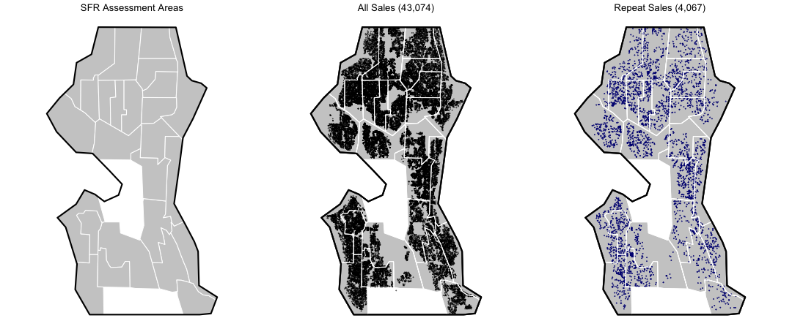
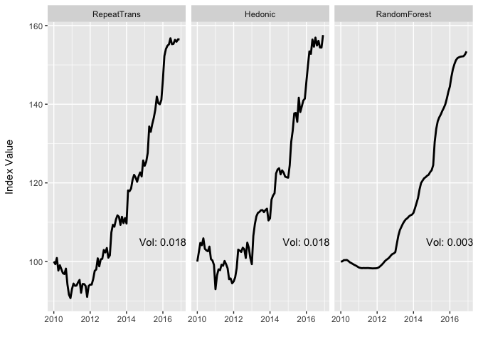
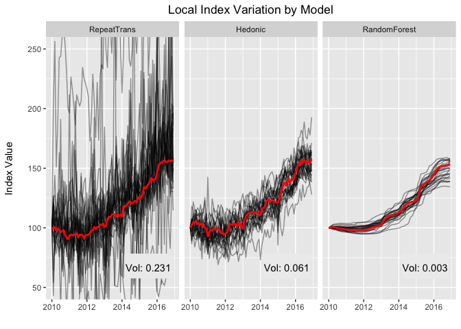

### Abstract

The previously researched approaches for generating house price indexes are almost exclusively found in the realm of traditional statistics, ranging from simple median calculation to complex multiple regression formats. This paper offers a new approach, using a maching learning model class -- random forests -- combined with a model-agnostic interpretability method -- partial dependency -- to derive home price indexes. After developing this method and providing an example, I then test the Interpretable Random Forest (IRF) approach against a repeat sales model and a hedonic pricing model approach.  Using data from the City of Seattle, my comparison suggests that the IRF is competitive (and occasionally superior to) existing methods across measures of accuracy, volatility and revision.

## Introduction

Traditionally, house price indexes have been generated through highly interpretable (statistical) modeling approaches such as measures of changes in median value or multiple regression models.  Both the repeat sales and the hedonic approach -- the two most commonly published approaches (Hill 2012; MacGuire et al 2013) -- are regression models. Parametric statistical models are a good fit for this task as the coefficient estimates are easily convertable into standardized price indexes. In short, house price index generation is not viewed as a prediction problem, but rather a scientific endeavor in which the attribution of the effects of time on market movements is sought. As a result, many of the rapidly growing set of machine learning algorithms -- e.g. support vector machines, random forests and neural networks -- have not been used in the production of price indexes due to the fact that they do not directly and/or easily attribute price impacts to the variables or features in the model. However, with the rise of interpretability methods (Ribiero et al. 2016; Doshi-Velez and Kim 2017; Molnar 2019), these 'black-box' models can be made more explainable and suitable for a more diverse set of tasks. 

This paper highlights the use of partial dependence -- a model-agnostic interpretability method (Molnar 2019) -- to generate house price indexes from a machine learning and inherently non-interpretable model. One of the major appeals of using a model-agnostic approach is that any underlying model class could be used on the data. In this work, I use a random forest, one of the more common and intuitive machine learning models. However, this choice of model class is only for convenience, as a neural network, for example, could just as easily have been used. Along with an explanation of the method and examples, the results from this application of a model-agnostic interpretability method are compared to the more traditional repeat sales and hedonic model approaches. The findings suggest that an Interpretable Random Forest appraoch to house price generation is competitive with (and occasionally prefereable to) the standard approaches across measure of accuracy, volatility and revision on a set of data from the City of Seattle. 

The remainder of this work is organized as follows:  Section two provides a brief literature review, focused on tying in machine learning approaches to the task of house price indexing. Next, I discuss the interpretable random forest (IRF) approach to creating a house price index and provide details using a dataset from the `hpiR` R package: Seattle, WA homes sales in the 2010 through 2016 period. In section four, the random forest method is compared to more traditional models across three metrics -- volatility, revision and accuracy. Finally, I conclude with a discussion and suggestions for future work. 

All data, analysis and visualization used and presented in this study are entirely reproducible.  Please see [www.github.com/anonymousREAuthor/irf](www.github.com/anonymousREAuthor/irf)^[NOTE TO REVIEWERS: This link will be changed to the official repository after blind peer review.  The linked site is an anonymous placeholder used solely for the purposes of review.] for details on downloading the code, accessing the raw data and reproducing the results.  

## Previous Work

Since the seminal Bailey et al. (1963) study there has been considerable and sustained research effort put into comparing and improving competing methods for generating house price indexes.  Published work in this subfield of housing economics is generally focused on one or more of four aims: 1) Comparison of model differences (Case et al 1991; Crone & Voith 1992; Meese and Wallace 1997; Nagaraja et al 2014; Bourassa et al 2016); 2) Identification and correction of estimation issues or problems (Abraham & Schauman 1991; Haurin & Henderschott 1991; Clapp et al 1992; Case et al 1997;  Steele & Goy 1997; Gatzlaff & Haurin 1997, 1998; Munneke & Slade 2000); 3) Creation of local or submarket indexes (Goodman 1978; Hill et al 1997; Gunterman et al 2016; Bogin et al 2019); and 4) Development of a new model or estimator (Case & Quigley 1991; Quigley 1995; Hill et al 1997; Englund et al. 1998, McMillen 2012; Bokhari & Geltner 2012; Bourassa et al 2016). 

This work develops and tests a framework for using random forest models combined with an inerpretability layer to create a house price index.  The review of literature focuses on these two novel components of the work. Readers interested in a broader coverage of approaches to and issues with existing house price index methods are direct to the "Handbook on Residential Property Prices Indices (Eurostat 2013).

### Random Forests

The term 'machine learning' often conjures the pejorative term 'black box'.  Or rather, a model for which predictions are given but for reasons unknown and, perhaps, unknowable, by humans. For use cases where a predicted outcome or response, be it a classfication or a regression problem, in itself is all that is required the 'black box'-ness of a model or algorithm may not be an issue (Molnar 2019).  However, in cases where model biases need to be diagnosed and/or individual feature or variable contributions are a key concern of the research or model application -- such as constructing house price indexes -- machine learning models need to be extended with interpretabilty methods.  

There are many options for the choice of machine learning model, though most all specific model classes fall into four generalized classes: 1) logical model (decision trees); 2) linear and linear combinations of trees or other features (random forests); 3) case-based reasoning (support vector machines); and 4) iterative summarization (neural networks) (Rudin and Carlson 2019). This paper uses random forests (Breiman 2001) as an example as they are a common modeling approach in the machine learning literature and industry. Random forests create a large set of many decision trees, each based on a random set of the data.  As each tree is grown, the partitions in the tree are limited to a random set of the variables (features) in the data. This set of (decision) trees 'grown' via random-ness makes a random forest.  To make a prediction, simply evaluate the subject instance (house in a real estate valuation context) in each tree -- which gives a predicted value -- and then combine all of these evaluations and take the mean (or some other measure of central tendency). The choice of the number of trees to use and the number of random variables to be considered at each partition step are (hyper) parameters that must be determined by the modeler.  

Random forests, essentially bootstrapped submarketing routines, also have a natural link to real estate valuation via the selection of small subsets of like homes to drive predictions. Interestingly, random forests have been little used in academic real estate studies (see Mayer et al 2019 for an exception) and not at all in house price index creation (to the knowledge of the author). This lack of use can likely be explained by the fact that random forests are somewhat of a black box in that they do not directly create coefficient estimates as more traditional statistical models do and, therefore, do not offer a direct approach to create price indexes. A random forest model by itself will provide a predicted value but no direct explanation of how that prediction was generated. In short, they are not inherently interpretable.

#### Interpretabilty Methods

As the use of machine learning models has grown, so too have methods to help raise the interpretability of these approaches (Slack 2019).  One such set of enhancements are termed 'model-agnostic interpretability methods' (Molnar 2019). Model agnostic interpretability methods are post-hoc models that can be applied to any learner or model in order to provide a specific enhancement or extension in the overal interpretability of the model.  Model agnostic interpretabilty methods can fall into a number of types or classes, some of which have varying aims.  Some of the most common approaches are:

* **Simulated or counterfactual scoring**. In these approaches, machine learning models compare scored (predicted) values of counterfactual observations across a given variable(s) while holding all others constant.  Individual conditional expectations (ICE) (Goldstein et al 2014) and partial dependence (PD) (Friedman 2001) are standard examples of this approach . Accumlated local effects (ALE) can also be used when extensive correlations exist in the independent variables (Apley 2016) of interest. Often a goal of these approaches is to understand the marginal contribution of one or more features towards the predicted value.

* **Game Theory (Shapley Values)**. A game theory or bargaining approach where variables or features (the players) compete to determine the optimal payout (coefficient) for their contributions to each observed price (Cohen et al 2005; Molner 2019).  Shapley values, like counterfactual scoring, seek to measure marginal contribution of specific features.

* **Global and local surrogates**.  Surrogate interpretable models that roughly approximate a black box model can provide human-interpretable explanations of black box models.  These surrogate models can be global -- spanning all observations -- or local -- confined to a small subset of the data, such as location.  The locally interpretable model explaination (LIME) method proposed by Ribiero et al (2016b) is the most widely known local surrogate approach.  Local and global surrogates are usually used to more deeply understand the prediction of one or a few individual instances.

* **Feature importance via permutation**. Judging the importance of a particular feature or variable within a black box model can be estimated via a permutation method (Gregorutti et al 2017).  This approach works by estimating a baseline model with all variables as is. For each feature (variable), permute or randomize the data for that feature and re-estimate the model.  Do this for all features one at a time and measure the relative degradation of model performance when each feature is randomized.  This provides a (relative) measure of which variables or features are the most important to the performance of the model. Feature importance measures are used to identify which features in the model provided the biggest (relative) gains in model performance.

In this work, I use measures of individual conditional expectations and partial dependence to extract interpretable insights on real estate market behavior over time. I have chosen this approach for two primary reasons.  First, the ICE/PD approach - via counterfactual scoring across the variable of interest, time -- conceptually mimics the basic questions that drive real estate price indexes, namely: What would this property/house have sold for at given intervals of time, had it sold repeated? In fact, this approach does exactly that by simulating a home sale for a given property at every time period in the study (individual condition expectation) and then combinines those changes in price over time across all properties (partial dependence).

Second, ICEs and PD are one of the easiest of the above methods to compute. Partial dependence calculations are known to be potentally biased when the variable of interest is highly correlated with other independent variables (Molnar 2019). Most variable used in standard hedonic pricing models, such as bedrooms, bathrooms and home size are often highly correlated.  Fortunately, for the purposes of house price index generation the variable of interest -- time of sale -- is generally highly orthogonal to other control variables making partial dependence an acceptable approach. This assumption could be violated if the quality or location of housing that transacts varies greatly over time.  Practically, this is only likely to occur in a relatively small geographic area that experienced significant new construction sales.  The data in our empirical tests span a large, built-out urban municipality so this concern is minimized. 

Partial dependence, and the individual conditional expectations that drive them, can be used to extract the marginal impact of each time period, conditionally, on the reponse or dependent variable: house prices in this case.  The resulting shape of the partial dependency -- linear, monotonic, sinusonoidal, spline-like, etc. -- is entirely depending on the underlying model being evaluated. Conceptually, an individual conditional expectation plot takes a single observation, $X_i$, and for one of the features or variables, $X_s$, simulates the predicted value of that observation under the hypothetical condition that this observation has the each individual unique value of $X_s$ found in the entire dataset.  By holding all other features constant, the marginal value of feature *s* on observation $X_i$ can be simulated. This represents an Individual Conditional Expectation. Averaging across all $X$ create a measure of partial dependency, often visualized by plotting, known as a partial dependency plot (Friedman 2001).

Converting this process to a real estate use for the purpose generating a house price index means valuing a given property ($X_i$) as if it had each unique value of time of sale ($X_s$) in the dataset. In other words, simulate the value of each property as if it had sold once in each time period. Do this for all properties in the dataset and average to get the full partial dependency of sale price on time of sale.  A key point here is that any type or class of model could be used to simulate the series of value predictions; the approach is model agnostic.  

#### An Example 

Figure 1 illustrates example plots of an individual condition expectation (left panel) and partial dependency (right) derived from a random forest model. The left hand panel applies an Individual Conditional Expectation approach on top of a random forest model with time as the variable of interest. Each point on the line, 48 in total, represent the estimated price of an example property for each month over hypothetical four-year time frame.  Applying this same approach to all homes in a dataset (695 in this example), provides the thin black lines in the right hand panel.  Averaging the full set of ICEs results in the partial dependency, shown in thick red.  

**Figure 1: Example of ICE and PD Plots**
<!-- -->

## Conceptual Framework

In conceptualizing how an interpretable machine learning process could map onto the standard approach(es) for creating house price indexes, it is helpful to abstract the generic process.  Broadly, estimating a house price index involves the following steps:

1) Choose a **model** and apply it to the data with the purpose of explaining house prices.  The chosen model will need to have a specification that accounts for one or more temporal variables or features in order to allow the model to capture or express any impacts that time may be having on prices.  Additionally, note that the choice of model class may be driven by data availablility -- e.g. data without rich hedonic features may be limited to a median or repeat sales specification.

2) Subject the model results to an **interpretability method** to generate insight into the data generating process.  For some models this is inherent (median by time period) and for others it is a standard output (regression beta coefficients).  However, the output of many machine learning models will provide only predicted values.  In these cases, a post-model interpretability method will need to be applied. 

3) Take the inherent or derived **insights into the DGP** -- the marginal contributions of each time period to price -- and convert those into an index via one of a standard set of indexes procedures. 

**Figure 2: Conceptual Model**

More simply, this can be mapped to three decisions or steps in the process.  The table below maps the three steps to actual processes from a standard hedonic price model example. 

| Step | Description |
| :---------------- | :------------------------------------------- | 
| (1) Choose a model | Specify a hedonic regression model using some configuration of temporal control variables |
| (2) Choose an interpretability method | Extract the coefficients on the temporal variables as the marginal contribution of each time period toward prices in the data |
| (3) Choose an indexing method | Convert these coefficients to an index via the Laspreyes approach |
| | |

Within this framework, we can now extend the creation of house price indexes to any class of model, machine learning or otherwise, provided that a sufficient interpretability method can be applied to extract or explain the marginal impact of time period on prices. In the interpretable random forest example above (Figure 1), the partial dependence estimates provide the 'insight into the data generating process' -- the impact of time on price -- that is used to generate the house price index. 

## Data and Model

In this section, I describe the data used in the empirical tests that follow as well as the particular model specifications employed.  As part of the data discussion, I describe the geographic subsetting employed to provide local tests as well as the city-wide global analyses. 

### Data

The data for this study originate with the King County Assessor.  All transactions of single family and townhome properties within the City of Seattle during the January 2010 through December 2016 period are included.  The data are found in the `hpiR` R package and can be freely downloaded and accessed within this package. The transactions were filtered to keep only arms-length transactions based on the County's Instrument, Sale Reason and Warning codes.  Additionally, any sale that sold more than once and underwent a major renovation between sales was removed as these transactions violate the constant quality assumptions made in the repeat sales models estimated below. Finally, a very small number of outlying observations -- those with sales under $150,000 and over $10,000,000 were removed. 

The data includes the following information for all 43,313 transactions:

| Field Name | Type | Example | Description |
| :----- | :-----: | :-----: | :------------------------- |
| pinx   | chr  | ..0007600046  | Tax assessor parcel identification number |
| sale_id  | chr | 2011..2621   | Unique sale identifier   |
| sale_price  | integer  | 308900   | Sale price  |
| sale_date  | Date   | 2011-02-22   | Date of sale   |
| use_type  | factor  | sfr   | Structure type   |
| area  | factor  | 15   | Tax assessor defined neighborhood or area   |
| lot_sf  | integer  | 5160   | Size of lot in square feet  |
| wfnt  | binary   | 1  | Is the property waterfront?  |
| bldg_grade  | integer  | 8 | Structure building quality  |
| tot_sf  | integer  | 2200   | Total finished square feet of the home |
| beds  | integer  | 3   | Number of bedrooms |
| baths  | numeric   |  2.5 | Numbrer of bathrooms   |
| age  | integer   | 100 | Age of home   |
| eff_age  | integer   | 12   | Years since major renovation   |
| longitude  | numeric   | -122.30254   | Longitude  |
| latitude  | numeric   | 47.60391  | Latitude  |

Within the data, there are 4,067 sale-resale pairs. This set of repeat transactions is limited to those which have at least a one year span between the two sales. This constraint is applied to avoid potential home flips, which more often than not violate constant quality assumptions (Steele and Goy 1997; Clapp and Giacotto 1999). 

### Local Subsamples

In addition to comparison on performance at the global (City of Seattle) level, I also break the data into the 25 major tax assessment zones for residential, single family properties.  Using the tax assessment zones (Shown in Figure 3) are preferable to common disaggregating regions such as Zip Codes as the tax assessment zones are relatively balanced in size and purposefully contructed to follow local housing submarket boundaries.  Of the 25 zones, 22 of them have between 1,100 and 2,300 sales over the 7-year period of this study.  The remaining three have 747, 2792 and 2827 sales.  

**Figure 3: Assessment Areas and Sales**

### Models

Three different models are compared in this work; 1) Interpretable random forest (IRF); 2) Hedonic price (HED); and 3) Repeat sales (RS).  The particular specifications, described in detail below, remain the same across the global and 25 local geographic areas. In all cases, indexes are estimated at a monthly frequency.  All models and associated metrics and visualizations are computed in the R statistical language (R Core Team 2019), details on package usage are contained in the discussion on each model. 

#### Interpretable Random Forest

Model specification for random forest are similar to those of standard hedonic price model.  The dependent variable (response) is the price of the home and the independent variables (features) are those factors that are believed to explain variance in the price.  The specification:

$log(P) = f(S, L, T)$

where $P$ is the sale price, $S$ are structural features of the home (including lot size), $L$ are locational features and $T$ are temporal features. More specifically, the structural features, $S$ include home size (sq.ft.), bedroom count, bathroom count, building quality and use type (SFR or townhome), locational features, $L$, are latitude and longitude and the temporal features , $T$, is the month of sale. 

Random forest models also require parameter to control how trees are grown and how many of them contribute to the forest. In each case 500 trees are grown, using an mtry of 3 and a minimum node (or leaf) size of 5.  The `ranger` R package is used to estimate the random forest models (Wright and Ziegler 2017).

#### Hedonic Model

To keep the comparison as 'fair' as possible, the hedonic model uses the same set of independent variables as the random forest:

$log(P) = f(S, L, T)$

where $P$ is the sale price, $S$ are structural features -- hoem size, lot size, bedrooms, baths, quality adn use type -- of the home, $L$ are locational features -- latitude and longitude -- and $T$ are temporal features. The temnporal features in the hedonic model are used as monthly dummy variables instead of a numeric vector as in the random forest.  This allows the hedonic model to identify non-monotonic changes in prices over time -- an ability that would not be possible if time were treated as an interger variable. 

Following the advice of Bourassa et al (2016), I specify a robust regression to help minimize the impact of any outliers or data errors that have avoided filtering.  Specifically, I use the `robustbase` R package to estimate a MM-estimator with a bi-square redescending score function (Maechler et al 2019).

#### Repeat Sales

Many implementations of repeat sales models implement Case and Shiller's (1989) three stage weighted approach that provided greater weight to shorter holds.  Work by Steele and Goy (1997) suggest that this may be a biasing factor as short holds are often less representative of standard home purchases and resales -- the initial sale is more likely to be an opportune buyer.  As a result of this and of work by Bourassa et al (2013), here too I opt for a robust regression approach to help moderate influence from outlying observation and/or changes to quality between sales that was not caught in the data preparate stage.  Again, the `robustbase` R package is used with an MM-estimate with a bi-square redescending score function (Maechler et al 2019). The standard formulation of the repeat sales model with a logged dependent variable:

$log(y_{it})-log(y_{is}) = \delta_2(D_{2,it} - D_{2,is}) + ... + \delta_\tau(D_{\tau,it} - D_{\tau,is} ) + u_{it} - u_{is}$

where $y_{it}$ is the resale, $y_{is}$ is the initial sale and the $D_{\tau,i}$s are the temporal period dummies, -1 for the period of the first sale, 1 for the period of the second sale and 0 for all others. 

## Results

I begin with visual comparison of indexes generated from the three models -- Interpretable Random Forest, Hedonic Price and Repeat Sales (Figure 5). There are three key takeaways from this comparison.  First, generally speaking the three model suggest similar price trends; initial evidence that the IRF approach 'works' in the sense that it can track broad market movements commensurate with established methods. 

Second, the IRF method is significantly less volatile period-to-period than the Hedonic and Repeat Sales approaches.  The extent of this difference and possible reasons for it will be discussed in the section on Volatility below.

Finally, the indexes diverge over the last 12 months of the index, essentially all of 2016.  Looking only at a single index it is difficult to pinpoint the rationale for this difference.  Or rather, is this a idiosyncratic difference due to the data for 2016 or is it a structural difference due to the IRF's method of estimation.  The fact that the random forest underlying the IRF approach treats time as a continuous variable and makes binary splits on that variable does suggest that it may produce 'overly-flat' estimates at the ends of the time period (both beginning and end) due to how the time periods are aggregated during the tree growing splits.  I'll explore this hypothesis further below. 

**Figure 5: Comparison of Indexes**
<!-- -->

### Accuracy

At a broad scale, the indexes similar time trends, but smaller variations do exist. I next ask, which is the more accuracy index generating method?  In this context, accuracy refers to the ability of the index to predict the second sale in a repeat sale pair. More simply, if we take the first sale in a repeat sale pair and adjust it with the index, how close is this adjusted value to the actual price of the second sale? When measuring the error -- or the difference between predicted and actual second sale -- we use log metrics due to their ability to avoid denominator bias and the skewness in possible errors that results (Tofallis 2015).  The formula for evaluating accuracy is:

$log(price_{pred}) - log(price_{actual})$

where the $price_{pred}$ is the time adjusted prediction and $price_{actual}$ is the actual sale price of the repeat (second) transaction in the sales pair.

Using repeat sales as our validation criteria does impart some advantage to the repeat transaction method; however, we evaluate accuracy in two distinct ways that lessen any perceived advantage this may provide.  First, we evaluate the ability of indexes to predict prices out-of-sample using a k-fold approach.  In this case, we use a 10-fold approach, whereby 90% of the sample is used to create an index that is then used to predict repeat sale prices on the 10% that was held out of the samnple.  This is done for each 10% random holdout. By doing so, no evaluation observations (repeat transaction) can influence the index used to predict its second sale price. We refer to error metrics from this approach as 'K-Fold' errors.

The convention k-fold approach can be a bit problematic in a longitudinal setting such as estimating house price indexes.  In any of the 90/10 splits, most of the holdout set is being valued by an index that 'knows the future'; or one that was estimated with information well after the holdout observation occured.  This situation does not well approximate many of the actual use cases of house price indexes which are often most interested in the fidelity of the index at the most recent point in time (i.e. last month or quarter).  Another approach to out-of-sample measurement is to forward predict, or to predict 'out-of-time'.  As an example, to measure out of sample (time) accuracy on a sale-resale pair that sold in period 1 and then again in period 30, we would use the data from period 1 to 29 to create an index, then foreward cast the index one period and evaluate the forward indexed price from period 1 against the subsequent sale in period 30.  In other words, we want to ensure the model is ignorant of the validation point (the period 30 sale) as well as an other future knowledge of market trends (as they are highly correlated within a market area across time). One major downfall of this approach is that is requires specificying and implementing a forecasting approach, which itself adds additional uncertainty to the process. The forward predictions are made with an ANN prediction approach (R `forecast` package...[NEED more info on this]). We refer to these error metrics as Prediction errors.

As both accuracy approaches have downfalls, I measure them both with an eye towards understanding if there are relative differences in performance based on the metric chosen.  I discuss these implications in the Discussion section below. Both error metrics are evaluated at both the Global and Local scales.  Additionally, we comparing accuracy statistcs we examine median absolute percentage error (MdAPE) and median percentage error (MdPE).  MdAPE measures the accuracy of the index while MdPE measures its bias.

#### Accuracy - Global

Global accuracy result are shown in Table 2.  For the K-Fold metrics, the Interpretable Random Forest approach shows the best accuracy (MdAPE), though the Repeat Sales model results in the lowest bias (lower MdPE). Moving over to Forecast evaluation, the Hedonic approach is the clear winner in terms of accuracy, with the Repeat Sales model again showing the lowest bias. The IRF model performs particularly poorly in the Forecast approach.  As alluded to above, this could be a direct product of the splitting processes used in Random Forest model which is likely to be slow to keep up with rapidly increasing markets (as experienced over this time frame). 

Based on the global accuracy values, neither of the three index approach methods clearly outperforms the others.  Repeat sales do hold lower biases in this sample, but, as is often the case, at the expensive of some bit of accuracy.  The reduced bias of the repeat sales model could also be a direct result of using repeat sales as the validation set. 

**Table 2: Global Accuracy**

Model           MdAPE (k-fold)   MdPE (k-fold)   MdAPE (forecast)   MdPE (forecast)
-------------  ---------------  --------------  -----------------  ----------------
Repeat Sales            0.0800         -0.0018             0.0832           -0.0055
Hedonic                 0.0823         -0.0329             0.0808           -0.0363
IRF                     0.0792         -0.0305             0.0876           -0.0612

#### Local Accuracy

Examining the local accuracy numbers shows some marked change from the Global figures.  The much smaller sample sizes in the Assessment zones creates a considerable decrease in accuracy (errors +70%) for the Repeat Sales model across both the K-Fold and Forecast metrics.  Accuracy numbers for the Hedonic and Random Forest also increased, but very slightly so.  In terms of accuracy, the Random Forest approach remains the most accurate in the K-Fold scenario, while the Hedonic again dominates in a predictive sense.  Biases remain high in the Random Forest approach.  Despite the large degradation in accuracy, the Repeat Sales model remains unbiased in the K-fold, but not in a forecast framework.

Model           MdAPE (k-fold)   MdPE (k-fold)   MdAPE (forecast)   MdPE (forecast)
-------------  ---------------  --------------  -----------------  ----------------
Repeat Sales            0.1368         -0.0025             0.1512           -0.0475
Hedonic                 0.0862         -0.0151             0.0821           -0.0328
IRF                     0.0816         -0.0413             0.0957           -0.0821

The accuracy evaluation suggests a number of stylized facts to be considered in the remainder of this paper:

* The move from Global to Local models did not improve accuracy in any model, and greatly harmed the Repeat Transaction models
* All models are either unbiased (Repeat Transactions) or show bias on the low end; are underpredicting second sale pricdes
* Random Forest models are more accurate than Hedonic in K-Fold, but this relationship switches in a Prediction scenario.

We spend the remainder of this paper exploring each of these facts through additional measures of model performance.

### Volatility

Volatility measures the variation in the index value from period to period.  While there is no ideal minimal level of volatility that is desired; no volatility at all signifies a perfectly flat index which is not desirable if there are market movements -- in general lower volatility is usually preferred to higher. High volatilty may be a sign of overfitting from the underlying model, or, as is often the case in areas with few sales, simply a product of small sample sizes.  

What is desirable is an index that tracks the market without fluctuating widely above and below the actual trend each period.  In this research, volatility is measured as the standard deviations of period-to-period changes in a rolling four-period time span.

$V = sd(D_{t, t+1, t+2})$ where $D = index_k - index_{k-1}$

This is an appealing metric as consistent, monotonic changes over a four month span -- the three measures of period changes -- will produce very low standard deviations.  On the contrary, wildly fluctuating indexes with irregular directionaly movements will produce high volatility measures. 

#### Global

Using the volatility metric defined above, we can measure the differences in 'smoothness' of the three approaches (Figure 6).  While the Repeat Sales and Hedonic methods have differences in their period to period movements, overall their levels of volatility are essentially the same.  The volatility of the IRF model is 1/6 that of the others, confirming what we saw visually in Figure 5.  

**Figure 6: Global Volatility**
<!-- -->

#### Local

Computing volatility for each of the 25 local areas (assessment zones) shows are much wider differential in volatility among the methods.  Moving to local models creates vastly greater volatility for the Repeat Sales model.  The smaller sample size has a much greater impact on Repeat Sales model as this approach already is an inefficient use of data -- doesn't use all transactions.  The hedonic model shows about 3 times the volatilty at the local level -- on average -- than globally.  For the IRF model, the local models are just as smooth as the global approach, a marked contrast from the other two methods.  Additionally, the spread of index values for the local areas are much tighter for the IRF than the two others.  

**Figure 7: Local Volatilty**
<!-- -->

### Revision

The final metric, revision, is the amount that previous index values change as a new period is added to the index.  For example, imagine the 5th period in our index is estimated at 110.  We then receive data for period 6 and the index value for period 5 is revised down to 109 due to changes in our model's coefficients as a result of the additional sample observations.  This is a revision of 1.  Here, we measure revision as the global mean of the individual mean of the revisions for each period in the index as it expands out to cover the entire time period.  Or, take an average of the combined average revisions to period 1, the average revisions to period 2, ..., the average revisions to period k.

$R = \sum{R_k}/k$ where $R_k = \sum{(K_j - K_{j-1})}/j$ where $j$ is the new index being generated after each addition of data. 

Revisions are particularly interesting and worthwhile metric for house price use cases that are continuously updating an index over time.  Large and consistent re-statements of prior index periods can be problematic, especially if the indexes are used to back financial instruments (Deng and Quigley 2008).  For indexes used to make adjustments to training data for automated valuation models and other appraisal purposes, systematic revisions in same direction -- sustained downward adjustments over time, for example -- can result in biased property valuation estimates other propogated errors.  

Figure 7 below shows the mean revision amount across the time period, by each model for the global models.  There are three key takeaways here: 1) The hedonic model has almost no revisions over time; 2) The Repeat Sales model has higher revisions in the earlier periods (final period aside) and these revisions are usually downward; and 3) the Random Forest approach suffers from the highest revisions in the later periods, all of which are upwards.

The findings regarding the stability of the Hedonic model and the tendency for downward adjustments from the Repeat Sales approach, echo those of previous work (Clapp and Giacotto 1999; Clapham et al 2006).  The later period adjustment for the IRF model, mimic earlier findings that suggest that the random forest tends to lag in periods of high price growth (the later part of the study period).  

**Figure 8: Mean Revision by Period (Global)**
<!-- -->

To further explore the relationship between overall price movements and adjustments, Figure 9 plots the mean revision in each period (y-axis) against the percent change in prices during that period.  For the Repeat Sales model we see slighly greater downwards revisions in periods of high appreciation, though the trend is rather weak. This may suggest that 'flip' type sales are a greater cause of revision than the underlying market, similar to rationale provided by Clapp and Giacotto (1999).  

As there are no real revisions for the hedonic model (middel panel) we see no noteworth trends here.  Add odds with Repeat Sales, the IRF approach shows significant positive correlation between revisions and the underlying price changes during the period. This supports the idea that the random forest lags during period of high appreciation, only to 'catch up' later via upward adjustments. 

**Figure 9: Revision vs Price Movement (Global)**
<!-- -->

Making the same comparisons -- revision vs period index change -- for the local indexes reveals a number of findings. One note for interpreting these plots: the X-axes vary between plots in order to fully capture the differences in volatility between the different models; the Y-axes are stable. First, the Hedonic approach (middle panel) remains very stable even with the greatly reduced sample sizes in the local models.  

The Repeat Sales approach shows a much more pronounced negative relationship between price movements and revisions at the local scale.  In other words, the higher the underlying price movement, the greater the downward revisions that occur over time. Again, for the IRF model the opposite is true.  Higher price appreciation means higher upward revisions.  Nearly all revisions to the local IRF models are upwards, but this fact should be not be interpreted as suggesting IRF doesn't generally adjust downwards.  Rather, this study period is one of either flat or increasing home prices (as evidenced by the X-axis in the right hand panel) and the lack of downward revisions is likely a result of this fact.  

**Figure 10: Revision vs Price Movement (Local)**
<!-- -->

## Discussion

This paper introduces a new approach to estimating house price index through the use of an interpretable machine learning model.  More specifically, it applies a model agnostic interpretability method -- partial dependency -- to an inherently opaque maching learning technique -- a random forest. From this combination we are able to extract the change in prices over time, holding quality constant. This approach is particularly well suited conceptually for a house price index as it values individual properties once each period to create an index; essentially the purpose of a house price index. The index itself tracks very similarly to those produced by more traditional repeat sales and hedonic price approaches supporting the viability of this approach empirically as well.

The interpretable random forest (IRF) is then compared against two traditional methods for measures of accuracy, volatility and revision; both globally and across 25 smaller assessment regions in the City of Seattle. There are a number of major findings.

In terms of accuracy at the global scale, all three models are relatively close with IRF the most accurate in a K-Fold validation and the hedonic model in a Forecast enviroment.  The Repeat Sales model remains the most un-biased, though this may be a product of Repeat Sales being used as the accuracy validation set.  Additional research is required to develop a more standardized approach for evaluating house price index accuracy.  At the local scale, both the IRF and hedonic model again show solid accuracy performance, however the Repeat Sales models at the local level degrade considerably.  

Creating smooth indexes is where the IRF method proves very useful.  Volatility for the IRF model, even at the local scale is ranges from 1/6 of the other at the global to upwards of 1/70th at the local scale. Given that the accuracy metrics for the IRF are comparable, in terms of producing a smooth index with high fidelity to the market movements, the IRF approach shows promise.  

Like the repeat sales approach, the IRF method suffers from revision as new data is added each period.  The scale of the revisions are slighly greater than the Repeat Sales at a Global Scale, though considerably smaller when the models are run locally.  Notably, the Repeat Sales model revises down during up periods while the IRF revises up during up periods.  For the Repeat Sales this is generally caused by data issues (short holds lacking constant quality Steele and Goy (1997)), while for the IRF model its a derivative of the Random Forest algorithm itself.  These revision to price movement correlations are amplified when moving from the global to the local model.  

Overall, from an accuracy and a volatility perspective the IRF model is a viable replacement for the repeat sales model and is competitive with a hedonic approach depending on whether or not accuracy or volatility are prefered metrics to one another.  A deficiency of the IRF approach is the systematic, postively correlated revisions during periods of rapid market movements; it is here that the 'smoothness' of the resulting IRF models becomes a liability.  More work it needed in this direction.

More broadly, this work highlights the viability of an inherently uninterpretable machine learning model (black box) paired with a model agnostic interpretability method to derive house price indexes.  While this work paired Random Forest with a partial dependency analysis, there is no reason other models -- such as a neural network -- could not be combined with other interpretability methods -- such as Shapley values.  As discussed in the Conceptual Framework section, all that is needed to create a house price index is a model of house prices, a method for understanding the data generating process in respect to the impact of time on price and an indexing method.  The traditional repeat sales and hedonic price approach are entrenched mostly out of convenience -- they offer directly interpretable beta coefficients -- and not, necessarily, out of any underlying superiority.  As machine learning approaches and their interpretability methods continue to develop, the status quo here will likely be continually challenged.  This is the first work to offer both a general framework for conceptualizing house price indexes in a machine learning context as well as offer a direct test of one approach across a number of important metrics -- accuracy, volatility and revision. 

### Reproducibility and Software

This work is completely reproducible.  All raw data and the code to transfrom them into the table and charts can be found at [https://www.github.com/anonreauthor/irf](www.github.com/anonreauthor/irf)^[NOTE to reviewers: This will be switched to my actual Github Repo after blind peer review.] All code is written in the R statistical language.  In addition to the `hpiR` package, which includes the custom functions for the IRF models and the wrapper functions that make for easy computation of accuracy, volatility and revision figures this work also directly uses the following R packages: `caret`(), `dplyr`(), `forecast`(), `ggplot`(), `imputeTS`(), `knitr`(), `lubridate`(), `pdp`(), `purrr`(), `ranger`(), `robustbase()`, `tidyr`() and `zoo`().  

## References

Abraham, J. M., & Schauman, W. S. (1991). New evidence on home prices from Freddie Mac repeat sales. *Real Estate Economics*, 19(3), 333-352.

Apley, D. (2016). Visualizing the Effects of Predictor Variables in Black Box Supervised Learning Models. [https://arxiv.org/abs/1612.08468](arxiv.org/abs/1612.08468)

Bailey, M., Muth, R., & Nourse, H. (1963). A Regression Method for Real Estate Price Index Construction. *Journal of the American Statistical Association*, 58, 933-942.

Bogin, A. N., Doerner, W. M., Larson, W. D., & others. (2016). Local House Price Dynamics: New Indices and Stylized Facts *FHFA Working Paper*.

Bokhari, S. & Geltner, D. J. (2012). Estimating Real Estate Price Movements for High Frequency Tradable Indexes in a Scarce Data Environment. *The Journal of Real Estate Finance and Economics* 45(2), 533-543.

Bourassa, S., Cantoni, E., & Hoesli, M. (2016). Robust hedonic price indexes. *International Journal of Housing Markets and Analysis*, 9(1), 47-65.

Breiman, L. (2001) Random Forests. *Machine Learning* 45(1), 5-32. [doi:10.1023/A:1010933404324](https://link.springer.com/article/10.1023/A:1010933404324)

Case, B., Pollakowski, H. O., & Wachter, S. M. (1991). On choosing among house price index methodologies. *Real Estate Economics*, 19(3), 286-307.

Case, B., Pollakowski, H. O., & Wachter, S. (1997). Frequency of transaction and house price modeling. *The Journal of Real Estate Finance and Economics*, 14(1), 173-187.

Case, B. & Quigley, J. M. (1991). The dynamics of real estate prices. *The Review of Economics and Statistics*, 50-58.

Case, K. & Shiller, R. (1987). Prices of Single Family Homes Since 1970: New Indexes for Four Cities. *New England Economic Review*, Sept/Oct, 45-56.

Case, K. & Shiller, R. (1989). The Efficiency of the Market for Single Family Homes. *The American Economic Review*, 79(1), 125-137.

Clapham, E., Englund, P., Quigley, J. M., & Redfearn, C. L. (2006). Revisiting the past and settling the score: index revision for house price derivatives. *Real Estate Economics*, 34(2), 275-302.

Clapp, J. M., & Giaccotto, C. (1999). Revisions in Repeat-Sales Price Indexes: Here Today, Gone Tomorrow? *Real Estate Economics*, 27(1), 79-104.

Clapp, J. M., Giaccotto, C., & Tirtiroglu, D. (1992). Repeat sales methodology for price trend estimation: an evaluation of sample selectivity. *Journal of Real Estate Finance and Economics*, 5(4), 357-374.

Cohen, SB, Dror, G & Ruppin, E (2005) Feature Selection Based on the Shapley Value. in *Proceedings of IJCAI*. pp. 1-6.

Crone, T. M., & Voith, R. (1992). Estimating house price appreciation: a comparison of methods. *Journal of Housing Economics*, 2(4), 324-338.

Doshi-Velez, F. and Kim, B. (2017) Toward a Rigorous Science of Interpretable Machine Learning. *arXiv::1702.08608*. [https://arxiv.org/abs/1702.08608](https://arxiv.org/abs/1702.08608)

Englund, P., Quigley, J. M., & Redfearn, C. L. (1999). The choice of methodology for computing housing price indexes: comparisons of temporal aggregation and sample definition. *The Journal of Real Estate Finance and Economics*, 19(2), 91-112.

Eurostat (2013) Handbook on Residential Property Prices Indices (RPPIs). *Eurostat: Methodologies and Working Papers* [doi:10.2785/34007](https://op.europa.eu/en/publication-detail/-/publication/cee09dbc-bf48-4126-a7d1-0bb9c028f648/language-en)

Friedman, J. (2001). Greedy function approximation: A gradient boosting machine. *Annals of statistics* 1189-1232.

Gatzlaff, D. H., & Haurin, D. R. (1997). Sample Selection Bias and Repeat-Sales Index Estimates. *The Journal of Real Estate Finance and Economics*, 14, 33-50.

Gatzlaff, D. H., & Haurin, D. R. (1998). Sample Selection and Biases in Local House Value Indices. *Journal of Urban Economics*, 43, 199-222.

Goldstein, A., Kapelner, A., Bleich, J. and Pitkin, E. (2014) Peeking Inside the Black Box: Visualizing Statistical Learning with Plots of Individual Conditional Expectiation.    [https://arxiv.org/pdf/1309.6392.pdf](arxiv.org/pdf/1309.6392.pdf)

Goodman, A. C. (1978). Hedonic prices, price indices and housing markets. *Journal of Urban Economics*, 5, 471-484.

Gregorutti, B., Bertrand, M., and Saint-Pierre, P. (2017) Correlation and variable importance in random forests. *Statistics and Computing*, 27(3), 659-678.

Guntermann, K. L., Liu, C., & Nowak, A. D. (2016). Price Indexes for Short Horizons, Thin Markets or Smaller Cities. *Journal of Real Estate Research*, 38(1), 93-127.

Haurin, D. R., & Hendershott, P. H. (1991). House price indexes: issues and results. *Real Estate Economics*, 19(3), 259-269.

Hill, R. (2013) Hedonic Price Indexes for Residential Housing: A Survey, Evaluation and Taxonomy. *Journal of Economic Surveys* 27(5), 879-914. [https://doi.org/10.1111/j.1467-6419.2012.00731.x](https://doi.org/10.1111/j.1467-6419.2012.00731.x)

Hill, R. C., Knight, J. R., & Sirmans, C. F. (1997). Estimating capital asset price indexes. *Review of Economics and Statistics*, 79(2), 226-233.

Hoesli, M., Giacotto, C., and Favarger, P. (1997) Three new real estate price indices for Geneva, Switzerland. *The Journal of Real Estate Finance and Economics*, 15(1), 93-109. 

McMillen, D. (2012). Repeat sales as a matching estimator. *Real Estate Economics*, 40(4), 745-773.

Maechler, M., Rousseeuw, P. Croux, C., Todorov, V., Ruckstuhl, A., Salibian-Barrera, M., Verbeke, T., Koller, M., Conceicao, E., and di Palma, M.A. (2019). robustbase: Basic Robust Statistics R package version 0.93-5. [http://CRAN.R-project.org/package=robustbase](http://CRAN.R-project.org/package=robustbase)
  
Maguire, P., Miller, R., Moser, P. and Maguire, R. (2016) A robust house price index using sparse and frugal data, *Journal of Property Research*, 33:4, 293-308, [https://doi.org/10.1080/09599916.2016.1258718](https://doi.org/10.1080/09599916.2016.1258718)

Mayer, M., Bourassa, S., Hoesli, M., and Scognamiglio, D. (2019). Estimation and updating methods for hedonic valuation. *Journal of European Real Estate Research.* 12(1), 134-150. https://doi.org/10.1108/JERER-08-2018-0035.

Meese, R. A., & Wallace, N. (1997). The construction of residential housing price indices: a comparison of repeat-sales, hedonic-regression, and hybrid approaches. *The Journal of Real Estate Finance and Economics*, 14(1), 51-73.

Molnar, C. (2019) *Interpretable Machine Learning: A Guide for Making Black Box Model Explainable*. Leanpub. ISBN 978-0-244-76852-2. [https://christophm.github.io/interpretable-ml-book/](https://christophm.github.io/interpretable-ml-book/)

Munneke, H. J., & Slade, B. A. (2000). An empirical study of sample-selection bias in indices of commercial real estate. *The Journal of Real Estate Finance and Economics*, 21(1), 45-64.

Nagaraja, C., Brown, L., & Wachter, S. (2014). Repeat sales house price index methodology. *Journal of Real Estate Literature*, 22(1), 23-46.

Quigley, J. M. (1995). A simple hybrid model for estimating real estate price indexes. *Journal of Housing Economics*, 4(1), 1-12.

R Core Team (2019). R: A language and environment for statistical computing. R Foundation for Statistical Computing, Vienna, Austria. URL https://www.R-project.org/.
  
Ribiero, M., Singh, S. and Guestrin, C. (2016) Model-agnostic Interpretability of Machine Learning. *arXiv::1606.05386*. [https://arxiv.org/abs/1606.05386](https://arxiv.org/abs/1606.05386)

Ribiero, M., Singh, S., and Guestrin, C. (2016b) "Why Should I Trust You?": Explaining the Predictions of Any Classifier. *Proceedings of the 22nd ACM SIGKDD International Conference on Knowledge Discovery and Data Mining.* pp 1135--1144, doi: 10.1145/2939672.2939778.

Rudin, C. and Carlson, D. (2019) The Secrets of Machine Learning: Ten Things You Wish You Had Known Earlier to Be More Effective at Data Analysis. *Tutorials in Operations Research* [https://arxiv.org/pdf/1906.01998v1](https://arxiv.org/pdf/1906.01998v1)

Slack, D., Friedler, S., Scheidegger, C. and Roy, C.D. (2019) Assessing the Local Interpretability of Machine Learning Models. [https://arxiv.org/pdf/1902.03501.pdf](https://arxiv.org/pdf/1902.03501.pdf)

Steele, M., & Goy, R. (1997). Short holds, the distributions of first and second sales, and bias in the repeat-sales price index. *The Journal of Real Estate Finance and Economics*, 14(1), 133-154.

Tofallis, C (2015). A better measure of relative prediction accuracy for model selection and model estimation. *Journal of the Operational Research Society*, 66, 1352-1362. doi:10.1057/jors.2014.103

Write, M. and Ziegler, A. (2017) ranger: A Fast Implmentation of Random Forests for High Dimensional Data in C++ and R. *Journal of Statistical Software*, 77(1), 1-17. 

